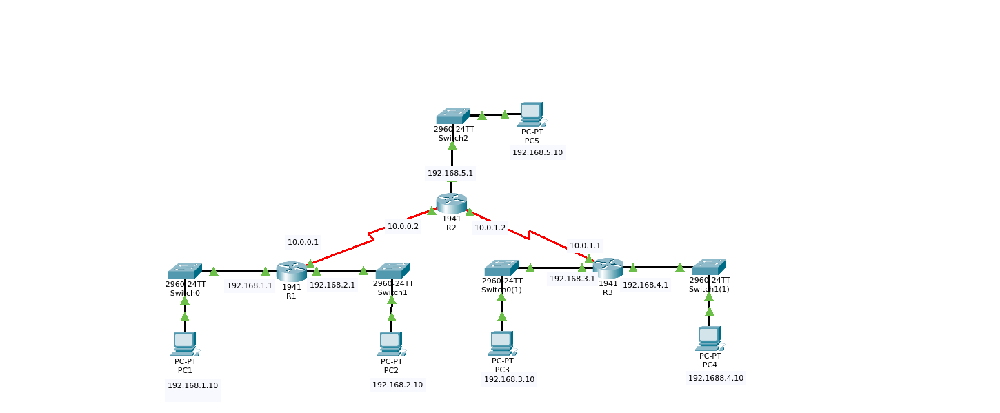

# Networking - Static Routing

A Cisco Packet Tracer project demonstrating the implementation of **Static Routing** using Cisco IOS. This lab focuses on manually configuring routes between multiple routers to enable communication across different networks.

## 📌 Project Overview

Static Routing is one of the fundamental routing techniques used in computer networks. In this project, three routers (R1, R2, R3) are interconnected through serial links, and static routes are manually configured to establish end-to-end connectivity between all LANs across the network.

This project is designed for students learning CCNA, computer networking, and Cisco router configuration.

## 🎯 Objectives

- Configure IPv4 addressing on routers and end devices
- Configure static routes on Cisco routers
- Verify routing tables
- Test end-to-end connectivity using Ping and Traceroute
- Understand how manually configured routes work

## 🖥️ Network Topology



R1 and R2 are connected via a serial link (`10.0.0.0/24`), and R2 and R3 are connected via a second serial link (`10.0.1.0/24`). R1 and R3 each host two LAN segments, while R2 hosts one LAN segment.

```
[LAN1]---[LAN2]---R1====R2---[LAN5]
                        ‖
                        R3---[LAN3]
                         \--[LAN4]
```

## 🌐 IP Addressing Table

| Router | Interface     | IP Address    | Subnet Mask     | Connects To |
|--------|---------------|---------------|------------------|-------------|
| R1     | Gi0/0         | 192.168.1.1   | 255.255.255.0    | LAN 1       |
| R1     | Gi0/1         | 192.168.2.1   | 255.255.255.0    | LAN 2       |
| R1     | Serial0/1/0   | 10.0.0.1      | 255.255.255.0    | R2          |
| R2     | Gi0/0         | — (shutdown)  | —                | unused      |
| R2     | Gi0/1         | 192.168.5.1   | 255.255.255.0    | LAN         |
| R2     | Serial0/1/0   | 10.0.0.2      | 255.255.255.0    | R1          |
| R2     | Serial0/1/1   | 10.0.1.2      | 255.255.255.0    | R3          |
| R3     | Gi0/0         | 192.168.3.1   | 255.255.255.0    | LAN 1       |
| R3     | Gi0/1         | 192.168.4.1   | 255.255.255.0    | LAN 2       |
| R3     | Serial0/1/1   | 10.0.1.1      | 255.255.255.0    | R2          |

## 📂 Repository Structure

```text
networking-static-routing/
│
├── README.md
├── topology.png
├── static-routing.pkt
│
└── configs/
    ├── R1.txt
    ├── R2.txt
    └── R3.txt
```

## 🛠️ Technologies Used

- Cisco Packet Tracer
- Cisco IOS
- IPv4 Addressing
- Static Routing
- Serial Communication

## 🚀 How to Use

1. Clone or download this repository
2. Open `static-routing.pkt` using Cisco Packet Tracer
3. Review each router configuration inside the `configs` folder
4. Verify routing using Cisco IOS commands

## ✅ Verification Commands

```bash
show ip route
show running-config
show ip interface brief
ping
traceroute
```

## 📖 Learning Outcomes

After completing this lab, you should be able to:

- Configure static routes
- Understand routing table entries
- Verify router connectivity
- Troubleshoot routing issues
- Understand manual path selection

## 📄 License

This project is shared for educational purposes.

## 👨‍💻 Author

Jawad Jamshed
